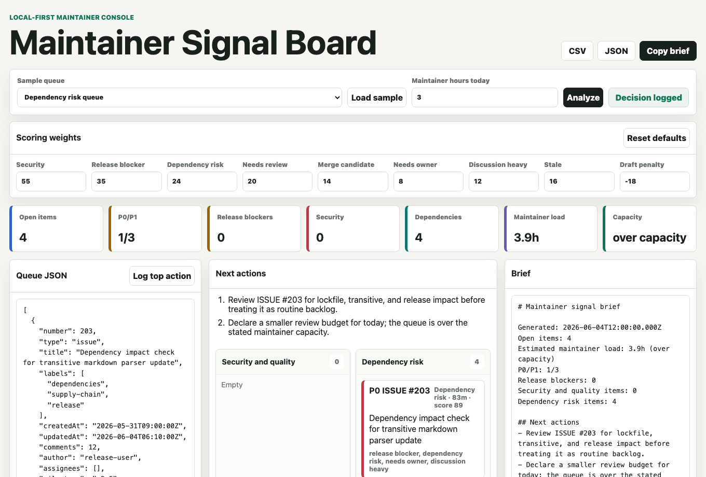

# Maintainer Signal Board

[](https://bte808.github.io/maintainer-signal-board/)
[](https://github.com/bte808/maintainer-signal-board/actions/workflows/ci.yml)


[](LICENSE)

Maintainer Signal Board is a local-first triage board for open-source maintainers. Paste issue or pull request JSON, or load a synthetic sample queue, and it turns the queue into maintainer lanes, review load estimates, release blockers, security and quality signals, and a copy-ready Markdown brief.

Live demo: <https://bte808.github.io/maintainer-signal-board/>



## Project Status

Maintainer Signal Board is an early `v0.5.0` static OSS tool. It is built to demonstrate a practical maintainer workflow, not to claim broad adoption or critical ecosystem status. The sample data is synthetic, and this project is not affiliated with OpenAI or endorsed by OpenAI.

Maintenance signals:

- MIT licensed.
- No runtime dependencies.
- Static, local-first GitHub Pages demo.
- Core scoring tests and desktop/mobile browser verification.
- Adjustable scoring weights for different maintainer styles.
- Preset scoring profiles for balanced, release, review, dependency, and community queues.
- Shareable local queue URLs stored in the browser URL hash.
- Dependency-risk heuristics for dependency and lockfile triage.
- Synthetic drill queues for release candidate, security hardening, and dependency review practice.
- Maintainer-facing docs for issue triage, PR review, release process, security, contribution, and conduct.
- GitHub issue templates and PR template for repeatable maintenance.

## Why This Exists

Open-source maintainers often carry the invisible work: deciding which issues need owners, which pull requests need review, which release blockers matter today, and which reports touch security or code quality. Maintainer Signal Board makes that workload visible without asking for repository tokens or hosted telemetry.

It is useful for:

- Pull request review queues.
- Issue triage and stale discussion follow-up.
- Release blocker checks.
- Security and privacy intake signals.
- Dependency-risk heuristics for package, lockfile, and transitive-update review queues.
- Copy-ready maintainer status notes.
- Small OSS projects that want a low-friction review ritual.

## What It Does

- Parses pasted JSON arrays or objects with an `items` array.
- Normalizes common GitHub-style fields such as `number`, `type`, `labels`, `created_at`, `updated_at`, `review_decision`, `mergeable`, `draft`, and `milestone`.
- Scores queue items from visible signals: security/privacy wording, release blockers, dependency-risk wording, stale age, review state, ownership, discussion load, and merge readiness.
- Lets maintainers apply scoring profiles, adjust scoring weights, and reset to documented defaults.
- Creates shareable local URLs for synthetic or sanitized queues without sending data to a server.
- Filters the board to a single maintainer lane and offers a compact view for larger queues.
- Groups work into maintainer lanes:
  - Security and quality.
  - Dependency risk.
  - Release blockers.
  - Needs review.
  - Ready to merge.
  - Community follow-up.
  - Backlog shaping.
- Estimates maintainer minutes and compares the queue to today's stated review capacity.
- Exports Markdown, CSV, and JSON locally.
- Keeps a small evidence log in `localStorage` so a maintainer can record the top action taken.

Dependency risk is based on title and label heuristics such as `dependencies`, `renovate`, `lockfile`, `npm audit`, `transitive`, and `sbom`. It is not a vulnerability scanner, package auditor, SBOM generator, or security validation tool.

## Demo Samples

The built-in queues are synthetic:

- Release week queue.
- Security patch queue.
- Dependency risk queue.
- Community backlog.
- Release candidate drill.
- Security hardening drill.
- Dependency review drill.

They are intentionally small and readable. They are fixtures for workflow review, not claims about real repository usage.

## Input Shape

Paste either an array:

```json
[
  {
    "number": 128,
    "type": "pull_request",
    "title": "Fix migration rollback on empty config",
    "labels": ["regression", "release-blocker"],
    "created_at": "2026-05-26T09:15:00Z",
    "updated_at": "2026-06-03T11:20:00Z",
    "comments": 8,
    "review_decision": "CHANGES_REQUESTED",
    "mergeable": false,
    "milestone": "v2.4"
  }
]
```

Or an object:

```json
{
  "items": []
}
```

The board also accepts mixed GitHub CLI preset objects with separate `issues` and `pullRequests` arrays. See the [GitHub CLI export recipe](docs/github-cli-export.md) for examples.

Use synthetic or sanitized data. Do not paste private repository names, secrets, tokens, customer details, or private organization data into public examples.

For a repeatable export flow, use the [GitHub CLI export recipe](docs/github-cli-export.md). A sanitized example fixture is available at [examples/sanitized-maintainer-queue.json](examples/sanitized-maintainer-queue.json).

## Run Locally

```bash
npm test
npm run verify:browser
npm run serve
```

Then open:

```text
http://localhost:5184/
```

Because the app is static, any local static server works.

## Verification

Local checks:

```bash
npm test
npm run verify:browser
npm run validate
git diff --check
```

`npm test` runs the core queue-analysis tests plus static wiring checks. `npm run verify:browser` starts a local server, opens temporary headless Chrome sessions, loads the board at desktop and `390 x 844` mobile sizes, loads starter and drill samples, analyzes queue data, checks lane filtering, toggles compact view, checks generated briefs, logs an action, and fails on horizontal overflow.

To refresh the README screenshot:

```bash
SAVE_SCREENSHOT=docs/demo.png npm run verify:browser
```

## Maintainer Docs

- [Issue triage playbook](docs/issue-triage-playbook.md)
- [PR review playbook](docs/pr-review-playbook.md)
- [Release playbook](docs/release-playbook.md)
- [GitHub CLI export recipe](docs/github-cli-export.md)
- [Maintenance log](docs/maintenance-log.md)
- [Contributing](CONTRIBUTING.md)
- [Security policy](SECURITY.md)
- [Code of conduct](CODE_OF_CONDUCT.md)

## Roadmap

- Add [keyboard shortcuts for repeated lane review](https://github.com/bte808/maintainer-signal-board/issues/14).
- Add [saved view presets for recurring maintainer rituals](https://github.com/bte808/maintainer-signal-board/issues/12).

## Security and Privacy

Maintainer Signal Board does not require an account, API key, backend service, analytics script, or hosted font. Draft input and evidence-log entries stay in browser `localStorage`; exports are generated locally.

For security-sensitive reports, follow [SECURITY.md](SECURITY.md) and avoid posting sensitive details publicly.

## License

MIT
